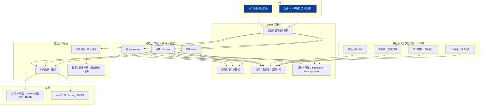

# 研伴（YanBan）· 投研个人智能体 —— 方案报告 草稿 v1

> 2026-09-07 ｜ 团队赛"技术文档 / 方案报告"底稿，同时是 PPT 与视频脚本的母本。标"**待校准**"的数字需在提交前用公司内部小问卷或真实测试替换。说"整理收件箱"后归入 `05_我的方案/方案文档/`。

---

## 一、项目概述

**一句话**：研伴是面向投资部、资管部、研究所全体投研人员的**个人投研智能体**——会读（晨读）、会查（问典）、会写（代笔），还守得住合规（隐盾）；技能公共，伙伴私有（我的）。

**口号**：把研究员的一天，还给研究。

**目标**：让每位投研人员每天少花 60 分钟在"找材料、翻规则、写模板"上，把时间还给判断与研究；同时把 AI 使用纳入公司安全边界（数据不出域、本机脱敏、全程留痕）。

**服务对象与场景**：研究员（晨读、周报）、投资经理（规则问答、限仓校验、事件提醒）、资管产品经理（产品报告初稿、合规自检）。对应大赛场景：投研风控、办公协作、内容创作；对应"人人都有智能体"主题。

**赛别**：团队赛主体；个人赛联动申报——晨读要点抽取 Prompt（技能赛道）、问典规则库（知识库赛道）、隐盾脱敏工具（工具赛道）、整体构想（金点子赛道）。

---

## 二、痛点与现状

### 2.1 研究员的一天（现状）

| 时段 | 事情 | 现在怎么做 | 耗时（待校准） | 问题 |
|---|---|---|---|---|
| 8:00–9:00 | 看昨夜到今晨的研报、交易所公告、宏观数据 | 逐份打开 PDF / 群消息，自己在脑子里汇总 | 40–60 分钟 | 看不完、记不住"谁和谁说法不同"、漏掉当天事件 |
| 全天穿插 | 查品种规则：涨跌停、保证金、限仓、最后交易日、交割流程 | 翻交易所网站 / 合约文本 / 问同事 | 每次 5–15 分钟，每天 2–4 次 | 规则常调整，口径记错风险高，答案没出处 |
| 16:00–17:30 | 写周报 / 投委会材料 / 产品运作报告 | 从零拼模板、复制数据、回忆本周要点、自己过合规词 | 60–90 分钟 | 重复劳动，合规漏项靠人盯 |
| 随时 | 把材料贴给大模型帮忙 | 直接贴 | — | 客户、账户、内部数据可能触碰合规红线 |

外部佐证：知识工作者约 60% 的时间消耗在查找、整理、邮件、会议与重复性数据处理上（麦肯锡测算，引自 QoderWork 分享）；中型企业 SaaS 工具数从 8 个膨胀到 130 个，信息碎片化加剧。

### 2.2 为什么通用大模型助手不够

| 维度 | 通用助手 | 投研人员真正需要 |
|---|---|---|
| 数据边界 | 上公网 | 不出域，且本机先脱敏 |
| 领域理解 | 泛泛 | 品种词典、交易所规则、公司口径 |
| 个性化 | 每次从零 | 记住我关注的品种、我的模板、我的口径 |
| 可信 | 无出处、数字会编 | 条款出处 + 计算过程 + 留痕 |
| 推广 | 各用各的 | 技能包一键复制到下一个部门 |

### 2.3 与公司现有系统的边界

研伴不做交易、不做风控系统、不做研判准确率考核；它只处理"人每天手工做的信息工作"，输入是公开研报、交易所公告、公司制度、个人模板，输出永远是"初稿 / 速读 / 带出处的回答"，最终判断与签发由人完成。

---

## 三、解决方案

### 3.1 产品形态：一个人 + 四项技能 + 一道门

| 模块 | 用户看到什么 | 背后怎么做 |
|---|---|---|
| 🌅 **晨读** | 8:30 一页速读：每个关注品种——各家怎么说、**分歧雷达**、关键数据、今日事件；可追问 | 材料 → 要点卡（立场 / 摘要 / 依据 / 数据 / 原句）→ 按关注画像聚合 → 分歧检测（只摆"谁和谁不同"，不判对错）→ 事件日历匹配 → 渲染；追问基于已读片段作答并标来源 |
| 📚 **问典** | 问规则，10 秒得到带出处的答案与计算过程 | 意图识别 → 参数库计算（涨跌停 / 保证金 / 限仓校验 / 最后交易日）→ 条款检索 → 模型只组织语言、不得改数字 |
| ✍️ **代笔** | 一键周报 / 投委会材料初稿，附合规自检清单 | 模板 + 晨读要点 + 数据 → 初稿；禁用表述 / 缺失要素 / 需核对三类检查；人改定签发 |
| 🛡️ **隐盾** | 贴任何内容前自动脱敏，用完还原；每次调用有留痕 | 正则 + 词典 → `<客户_1>` 语义标签，映射表仅本机；渐进授权；审计只存摘要哈希 |
| ⚙️ **我的** | 关注品种、角色、周期、模板、偏好、反馈 | L0 材料 → L1 要点卡 → L2 品种合集 → L3 个人画像；同一批材料按画像给不同的人不同的晨读 |

### 3.2 研究员的一天（使用后）

8:30 晨读 5 分钟（原 40–60）→ 10:00 问典 10 秒/次（原 5–15 分钟）→ 16:00 代笔 15 分钟改定（原 60–90）→ 全程隐盾。**每人每天节省约 60 分钟（待校准）。**

### 3.3 设计原则

1. **宁短勿错**：每条要点带来源；模型输出解析失败自动退回规则引擎；报告丰富度与事实性负相关，速读克制。
2. **数字由程序算，模型只组织语言**：问典的每个数字来自参数库与计算器，模型不得改动。
3. **人在关键节点**：晨读的"加入关注"、代笔的"改定签发"、隐盾的高危动作确认，都由人点。
4. **技能公共，伙伴私有**：技能 = 规范（Prompt）+ 代码（规则兜底 + 计算）+ 资源（词典 / 参数 / 模板）；个性化只在画像层。

---

## 四、创新点

1. **关注画像驱动的个性化晨读**（L0→L3 分层）：不是"给所有人同一份摘要"，而是"同一批材料、每人一份"。
2. **分歧雷达**：自动把"谁和谁说法不同、分歧在哪个环节"摆出来——研究员最想知道的正是这个；刻意不做对错判断，避免与考核挂钩。
3. **带出处的规则计算**：把"聊规则"变成"算规则 + 引条款"，可核对、可追溯。
4. **技能化架构与规范即合约**：四项技能各自可复用、可单独交付，换部门只换资源；Agent 只在规范内发挥。
5. **隐盾 + 渐进授权**：把合规做成产品特性——本机脱敏、数据不出域、高危永远拦截、留痕不存原文。

---

## 五、技术架构

**技术选型**：Python 3.10+；pydantic 数据模型；SQLite 记忆与留痕；Streamlit 界面（决赛前可换企业前端）；LLM 走 OpenAI 兼容接口（`LLM_API_BASE / LLM_API_KEY / LLM_MODEL`），支持公司 AI 平台与本地模型；无 key 时规则引擎兜底。**模型只做三件事**：要点抽取的 JSON 输出、答案与周报的语言组织、追问的片段归纳；其余全部是确定性程序。

**部署**：单机可跑（研究员本机或部门服务器），无外部依赖；数据目录可指向部门共享盘；后续接入 IM 推送与定时任务。

---

## 六、安全与合规

| 大赛 / 公司要求 | 研伴的做法 |
|---|---|
| 未脱敏的客户身份、交易持仓、内部财务数据不得上公网大模型 | 隐盾：进模型前本机脱敏为语义标签，映射表不出本机；模型只在公司 AI 平台（内网 / 授权 API）调用 |
| 数据合规脱敏，符合监管及公司安全防线 | 三道防线：目录级授权（只读指定文件夹）→ 脱敏 → 高危动作拦截（外发、删除、改系统永不放行） |
| 过程可追溯 | 每次调用留痕：时间、技能、动作、输入 / 输出摘要哈希、脱敏计数、引擎；不存原文 |
| 不误导决策 | 晨读不判对错、周报由人签发、问典标注"以交易所最新公告为准" |
| 渐进授权 | 首次询问 → 会话内允许 → 长期信任 → 高危永远拦截（参考成熟桌面 Agent 实践） |

引用依据：《生成式人工智能个人信息保护技术要求》第 6 部分（输出阶段默认不展示已识别个人信息）、第 8 部分（向第三方提供前先去标识化）——写进合规页可加分。

---

## 七、业务价值与成效

### 7.1 口径与算法

- 每人每天节省 ≈ 晨读 35 分钟 + 问典 15 分钟 + 代笔 10 分钟（周报 60 分钟按周均摊）= **60 分钟（待校准）**
- 全公司：N 位研究员 + 投资经理 + 资管产品经理 × 60 分钟 × 250 交易日 ÷ 8 小时 ≈ **31 × N 人日 / 年**（N = 40 → 约 1,250 人日 ≈ 5 个人年；**N 待 Jerry 提供**）
- 质量收益：规则口径错误率下降（有出处可核）、周报合规漏项下降（自检）、AI 使用合规事件为零（隐盾）

### 7.2 评测计划（提交前完成，写进方案的"成效"页）

| 指标 | 方法 | 目标 |
|---|---|---|
| 晨读要点准确率 | 30 篇公开研报人工标注要点与立场，与研伴输出比对 | ≥ 85% |
| 晨读有用率 | 5 位研究员连续 5 天盲评"有用 / 一般 / 没用" | 有用 ≥ 70% |
| 问典准确率 | 50 道规则题（含 20 道计算题）人工核对 | 计算题 100%，规则题 ≥ 90% 且出处正确 |
| 代笔合规命中率 | 20 篇含人为埋点的草稿 | 禁用表述召回 ≥ 95% |
| 节省时间 | 3 位用户前后各记 3 天 | 与口径对照 |
| 成本 | 每次晨读 Token 与耗时 | 单次 < 0.5 元、< 60 秒（待实测） |

---

## 八、可复制推广

- **换部门 = 换资源**：技能不动，换品种词典、规则库、模板、合规词表即可服务子公司、分支机构、风险管理子公司。
- **三档推广路线**：本部门试用（1 个月）→ 全所 + 投资 / 资管（2 个月）→ 子公司复制（技能包 + 部门资源包）。
- **最轻落地形态**：晨读结果可导出 Markdown / 落成多维表格；不需要每个人装环境，部门服务器一份即可。
- **技能市场雏形**：个人赛四个赛道的成果就是四个可发布的技能包。

---

## 九、实施计划与团队分工

| 里程碑 | 时间 | 交付 |
|---|---|---|
| 报名 | 9/11 | 申报表、5 人名单 |
| 接入公司 AI 平台、换真实公开材料 | 9/15 | 晨读 / 问典跑真实数据 |
| 评测集与首轮评测 | 9/25 | 第七章六项指标初值 |
| 方案文档 v2、PPT v1 | 10/8 | 本文定稿、PPT |
| Demo 视频（3–5 分钟、≥720P）、技术文档 | 10/17 | 提交包 |
| 提交 | 10/20 | 官网上传 |
| 决赛路演 | 10/24 | 现场真实环境演示 |

| 角色 | 部门（建议） | 负责 |
|---|---|---|
| 业务发起人 | 研究所 | 真实痛点与材料、评测标注、决赛讲业务价值 |
| 风控 / 合规 | 风控合规部 | 脱敏规则、权限、合规页背书 |
| 技术负责人 | IT（Jerry） | 架构、技能引擎、AI 平台接入 |
| 技术开发 | IT / 子公司 IT | 界面、数据接入、推送；子公司成员带来协同加分 |
| 产品 / 运营 | 资管或市场 | PPT、视频、路演脚本、成效换算 |

---

## 十、风险与应对

| 风险 | 应对 |
|---|---|
| 大而全被质疑 | Demo"两深一浅"：晨读、问典做深，代笔做浅；随时可收缩为单技能 |
| 与"观点准确率考核"混淆 | 分歧雷达只摆说法不同，明确写"不做对错判断、不做考核" |
| 材料获取 | 只用公开研报、交易所公告、公司制度；示例数据全部虚构并标注 |
| 模型幻觉 | 数字由程序算；宁短勿错；输出带出处；规则兜底 |
| 现场演示翻车 | mock 模式保底；示例材料与真实材料双准备；评测数字提前固化 |
| 合规质疑 | 隐盾 + 留痕 + 引用国标条款；风控合规部成员背书 |

---

## 附录

- Demo：`05_我的方案/Demo/研伴/`，`python run_demo.py` 一键跑通，`streamlit run app.py` 打开界面；6 项自动化测试。
- 示例数据声明：研报、公告、规则参数与条款均为虚构 / 示例值，正式演示前替换为原文并填入公告文号。
- 参考实践：QoderWork 桌面 Agent（设计哲学、三道防线、渐进授权）、OPPO 小布助手（自适应规划与个性化评测）、OPPO 小布记忆（记-管-用与记忆分层）、蚂蚁 CIO（三模式与分阶段治理）、腾讯玄武 HaS（脱敏防火墙）、中软融鑫（受约束 Agent）。
