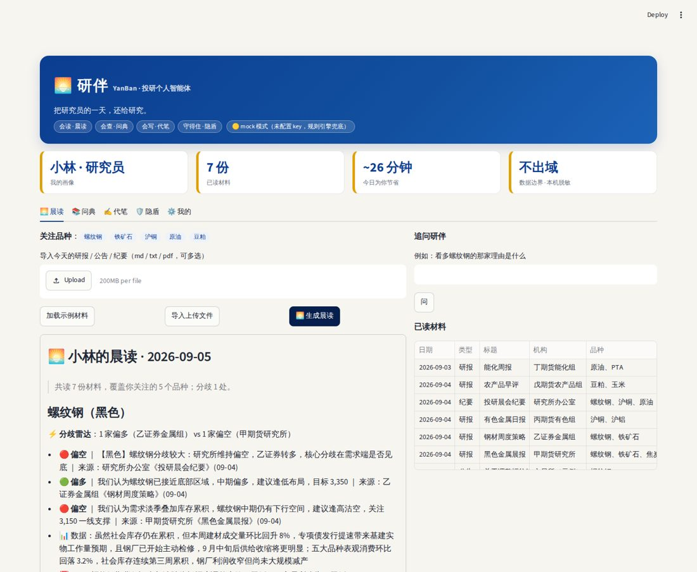

# 研伴 YanBan · 投研个人智能体（Demo v0.1）

> **把研究员的一天，还给研究。**
> 投资、资管、研究员的个人投研智能体——会读（晨读）、会查（问典）、会写（代笔），还守得住合规（隐盾）；技能公共，伙伴私有（我的）。



## 5 分钟跑起来

```bash
cd 05_我的方案/Demo/研伴
python3 -m venv .venv && source .venv/bin/activate      # 可选
pip install -r requirements.txt
cp .env.example .env        # 填公司 AI 平台的 LLM_API_BASE / LLM_API_KEY / LLM_MODEL；不填也能跑（mock 模式，规则引擎兜底）
python run_demo.py          # 命令行跑通四项技能
streamlit run app.py        # 打开界面
```

## 四项技能 + 一道门 + 一个"我"

| 模块 | 做什么 | 代码 | 规范（Prompt） | 资源 |
|---|---|---|---|---|
| 🌅 晨读 | 材料按「我的关注」做 5 分钟速读：各家怎么说、**分歧雷达**、数据、今日事件；可追问 | `yanban/skills/morning.py` | `prompts/morning_extract.md` | `data/sample_docs/`、`data/events.csv` |
| 📚 问典 | 规则问答 + 计算（涨跌停 / 保证金 / 限仓校验 / 最后交易日），每个数字带出处 | `yanban/skills/rulebook.py` | `prompts/rulebook_answer.md` | `data/rules/params.json`、`data/rules/*.md` |
| ✍️ 代笔 | 模板 + 晨读要点 → 周报初稿；合规自检（禁用表述 / 缺失要素 / 需核对） | `yanban/skills/writer.py` | `prompts/writer_weekly.md` | `data/templates/`、`data/compliance_terms.json` |
| 🛡️ 隐盾 | 进模型前脱敏为语义标签、本地还原；渐进授权；留痕只存摘要哈希 | `yanban/privacy.py`、`yanban/memory.py` | — | — |
| ⚙️ 我的 | 关注品种、角色、口径偏好、反馈；同一批材料按画像给不同的晨读 | `yanban/profile.py` | — | `data/profile.json` |

每项技能 = 规范（Prompt）+ 代码（规则兜底 + 计算）+ 资源；**换部门只换资源与模板**。

## 设计原则（对应评分维度）

- **业务价值**：每人每天省 ~60 分钟（晨读 35 + 问典 15 + 代笔 10），界面顶部实时累计。
- **创新**：关注画像驱动的个性化（L0 材料 → L1 要点卡 → L2 品种合集 → L3 画像）；分歧雷达只摆"谁和谁不同"，不判对错；带出处的规则计算。
- **技术落地**：纯 Python + SQLite；OpenAI 兼容 API（BYOK，`.env`），无 key 也能跑；模型只负责组织语言，数字由程序算。
- **可复制**：技能包形态，换资源即换部门；晨读结果可导出 md，也可落成多维表格。
- **安全合规**：本机脱敏、数据不出域、高危动作永远拦截、每次调用留痕（不存原文）。

## 目录

```
app.py / run_demo.py       界面 / 命令行
.streamlit/config.toml     品牌主题（深海蓝 + 琥珀金）
yanban/                    config · llm · privacy · memory · profile · docs · symbols · skills/{morning,rulebook,writer}
prompts/                   三份规范（技能赛道成果）
data/                      示例材料（虚构）、事件日历、规则参数与条款（示例）、模板、合规词表、画像
tests/test_yanban.py       6 项全链路测试：pytest -q
```

## 示例数据声明

`data/sample_docs/` 的研报与公告、`data/rules/` 的参数与条款均为**演示用虚构 / 示例值**，正式演示前替换为公开研报原文与交易所公告原文，并在 `params.json` 的 `source` 填入公告文号。

## 下一步

- 接公司 AI 平台后，用真实公开研报做 30 篇人工标注评测集，报告要点抽取与立场识别准确率。
- 问典规则库换成交易所规则原文 + 公司制度（按权限分级），自备 50 道业务问题。
- 晨读定时任务 + 推送（企业 IM / 邮件），周报导出 docx。
